<div align="center">

# PentestIQ 🛡️


**AI-Assisted Network & Web Security Testing Platform for Ethical, Localhost-Focused Penetration Testing**

</div>

---

## 📋 Overview

PentestIQ is an intelligent security testing platform that bridges the gap between powerful penetration testing tools and accessibility. By combining automated vulnerability scanning with local AI-powered analysis, PentestIQ helps developers, security researchers, and students conduct ethical security assessments in a controlled, privacy-focused environment.

The platform orchestrates industry-standard tools like **Nmap** and **Nikto**, analyzes their findings using a local LLM (via Ollama), and presents actionable security insights through an intuitive dashboard and professional reports—all while operating entirely offline to protect sensitive data.

### 📊 Project Presentation

Want a visual overview? Check out our comprehensive project presentation:

**[📥 Download PentestIQ Presentation (PPTX)](./PentestIQ.pptx)**

The presentation covers:
- Project overview and motivation
- System architecture and workflow
- Key features and capabilities
- Technical implementation details
- Demo scenarios and use cases
- Future roadmap

---

## 🎯 Problem Statement

Modern penetration testing faces several critical challenges:

- **Complexity Barrier**: Tools like Nmap, Nikto, and Metasploit have steep learning curves that intimidate beginners
- **Misuse Risk**: Powerful scanning tools can easily be misused for unauthorized testing, creating legal and ethical concerns
- **Lack of Explainability**: Raw scan outputs are dense, technical, and difficult to interpret without expertise
- **Time-Consuming Analysis**: Manual review of scan results is tedious and error-prone
- **Privacy Concerns**: Cloud-based security platforms may expose sensitive infrastructure data

---

## 💡 Solution

PentestIQ addresses these challenges through:

### 🤖 AI Orchestration
- Local LLM analyzes scan results and translates technical findings into clear, actionable insights
- AI-powered vulnerability explanations with severity assessment and remediation guidance
- Automated report generation with executive summaries and technical details

### 🔒 Ethical Enforcement
- Built-in scope validation ensures testing only occurs on authorized targets (localhost by default)
- Configurable safeguards prevent accidental scanning of external networks
- Audit logging for accountability and compliance

### 🏠 Privacy-First Design
- Fully offline operation—no data leaves your machine
- Local LLM processing ensures sensitive scan results remain private
- Optional blockchain layer for tamper-proof report verification without cloud dependencies

---

## ✨ Key Features

| Feature | Description |
|---------|-------------|
| 🌐 **Automated Network Scanning** | Integrated Nmap scanning with intelligent port discovery and service detection |
| 🔍 **Web Vulnerability Scanning** | Nikto-powered web server analysis for common security misconfigurations |
| ✅ **Ethical Scope Enforcement** | Configurable target validation to prevent unauthorized scanning |
| 🧠 **Local AI Vulnerability Explanation** | LLM-powered analysis that translates technical findings into understandable insights |
| 📊 **Interactive Dashboard** | Real-time visualization of scan progress and vulnerability distribution |
| 📄 **Professional Report Generation** | Exportable PDF/HTML reports with executive summaries and technical details |
| ⛓️ **Blockchain Report Integrity** | Optional cryptographic hash storage for tamper-proof report verification |

---

## 🏗️ System Architecture Overview

```mermaid
flowchart TD
    Start([🚀 User Initiates Scan]) --> Input[📝 Manual Input<br/>Web UI / CLI]
    
    Input --> API[🔌 FastAPI Gateway<br/>Authentication & Validation]
    
    API --> Scope{✅ Scope Validator<br/>Target Authorized?}
    
    Scope -->|❌ Rejected| Reject[🚫 Return Error<br/>Unauthorized Target]
    Scope -->|✅ Authorized| Queue[📋 Scan Queue Manager]
    
    Queue --> Orchestrator[⚙️ Orchestrator<br/>Select Scanner]
    
    Orchestrator --> Scanner{🔍 Scanner Selection}
    
    Scanner -->|Network Scan| Nmap[🌐 Nmap<br/>Port & Service Discovery]
    Scanner -->|Web Scan| Nikto[🔎 Nikto<br/>Web Vulnerability Scan]
    
    Nmap --> Parse[🔄 Result Parser<br/>Extract & Normalize Data]
    Nikto --> Parse
    
    Parse --> Store1[(💾 File Storage<br/>Scan Results & Output)]
    Parse --> AI[🧠 Ollama LLM<br/>Analyze Vulnerabilities]
    
    AI --> Analyze[📊 Vulnerability Analysis<br/>+ Risk Assessment]
    
    Analyze --> Report[📝 Report Generator<br/>Executive Summary]
    
    Report --> Store1
    
    Store1 --> Output{📤 Output Generation}
    
    Output --> Dash[📊 Interactive Dashboard<br/>Real-time Visualization]
    Output --> PDF[📄 PDF Report<br/>Professional Format]
    Output --> HTML[🌐 HTML Report<br/>Web Format]
    
    Dash --> User([👤 User Reviews Results])
    PDF --> User
    HTML --> User
    
    Report -.->|Optional| Chain[⛓️ Blockchain<br/>Hash Storage<br/>Tamper-Proof]
    
    Reject --> End([❌ End])
    User --> End([✅ End])
    
    %% Styling
    classDef inputStyle fill:#4A90E2,stroke:#2E5C8A,stroke-width:3px,color:#fff
    classDef processStyle fill:#F39C12,stroke:#B8730D,stroke-width:2px,color:#fff
    classDef scanStyle fill:#E74C3C,stroke:#A93226,stroke-width:2px,color:#fff
    classDef aiStyle fill:#9B59B6,stroke:#6C3483,stroke-width:2px,color:#fff
    classDef storageStyle fill:#34495E,stroke:#1C2833,stroke-width:2px,color:#fff
    classDef outputStyle fill:#16A085,stroke:#0E6655,stroke-width:2px,color:#fff
    classDef decisionStyle fill:#E67E22,stroke:#A04000,stroke-width:2px,color:#fff
    classDef optionalStyle fill:#95A5A6,stroke:#626567,stroke-width:2px,color:#fff,stroke-dasharray: 5 5
    
    class Start,Input,User,End inputStyle
    class API,Queue,Orchestrator,Parse,Analyze,Report processStyle
    class Nmap,Nikto scanStyle
    class AI aiStyle
    class Store1 storageStyle
    class Dash,PDF,HTML outputStyle
    class Scope,Scanner,Output decisionStyle
    class Chain optionalStyle
    class Reject scanStyle
```



---

## 🛠️ Tech Stack

### Backend
- **Python 3.9+**: Core application logic and tool orchestration
- **FastAPI**: High-performance REST API framework
- **Ollama**: Local LLM inference for AI-powered analysis
- **Nmap**: Network discovery and security auditing
- **Nikto**: Web server vulnerability scanner

### Frontend
- **React / Next.js**: Modern, responsive web interface
- **Tailwind CSS**: Utility-first styling framework
- **Chart.js**: Vulnerability visualization and metrics

### Infrastructure
- **Docker**: Containerized deployment for consistency
- **Docker Compose**: Multi-container orchestration
- **GitHub Actions**: CI/CD automation

### Optional Components
- **Web3.py**: Blockchain integration for report integrity
- **Redis**: Caching layer for scan results

---

## 🚀 Getting Started

### Prerequisites

- Python 3.9 or higher
- Docker and Docker Compose
- Ollama installed locally
- Node.js 18+ (for frontend)

### Installation

1. **Clone the repository**
   ```bash
   git clone https://github.com/yourusername/pentestiq.git
   cd pentestiq
   ```

2. **Install backend dependencies**
   ```bash
   cd backend
   pip install -r requirements.txt
   ```

3. **Install frontend dependencies**
   ```bash
   cd ../frontend
   npm install
   ```

4. **Configure environment variables**
   ```bash
   cp .env.example .env
   # Edit .env with your configuration
   ```

5. **Pull Ollama model**
   ```bash
   ollama pull llama2
   ```

6. **Start the application with Docker**
   ```bash
   docker-compose up -d
   ```

7. **Run backend server (alternative to Docker)**
   ```bash
   cd backend
   python -m uvicorn main:app --reload
   ```

8. **Run frontend development server**
   ```bash
   cd frontend
   npm run dev
   ```

9. **Access the dashboard**
   
   Open your browser and navigate to `http://localhost:3000`

### Quick Test

Run a sample scan on localhost:

```bash
curl -X POST http://localhost:8000/api/scan \
  -H "Content-Type: application/json" \
  -d '{
    "target": "localhost",
    "scan_type": "quick",
    "tools": ["nmap"]
  }'
```

---

## 💼 Use Cases

### 👨‍💻 Developer Security Testing
Developers can quickly assess their applications for common vulnerabilities before deployment, ensuring secure coding practices and catching issues early in the development lifecycle.

### 🎓 Academic Research & Learning
Students and researchers can safely learn penetration testing techniques in a controlled environment without risk of unauthorized access or legal complications.

### 🚀 Startup Vulnerability Assessment
Small teams with limited security resources can conduct regular security audits without expensive commercial tools or cloud services.

### 🔄 Secure DevOps Workflows
Integrate automated security scanning into CI/CD pipelines for continuous security validation with privacy-preserving local analysis.

---

## 🔮 Future Scope

We're continuously improving PentestIQ. Upcoming features include:

- 🔧 **Additional Scanners**: Integration with OWASP ZAP, SQLMap, and custom vulnerability modules
- 🧠 **Enhanced AI Reasoning**: Multi-model analysis for deeper vulnerability context and attack chain detection
- 🏢 **Enterprise Integrations**: JIRA, Slack, and ticketing system connectors for seamless workflow integration
- 📊 **Advanced Reporting**: Customizable templates, compliance mapping (OWASP Top 10, CWE, CVE), and trend analysis
- 🤝 **Collaborative Features**: Team workspaces and shared scan repositories
- 🔌 **Plugin Architecture**: Extensible framework for custom scanners and AI models
- 📱 **Mobile Dashboard**: iOS/Android apps for on-the-go security monitoring

---

## 👥 Team

This project is maintained by security enthusiasts committed to making ethical hacking accessible and educational.

- **Abhishek Angadi** - Project Lead & Backend Developer
- **Yash Chokat** - AI Integration & Analysis
- **Abhinay Nachankar** - Frontend & UI/UX Design
- **Prakash Gond** - Security Research & Testing

*Interested in contributing? Check out our [Contributing Guidelines](CONTRIBUTING.md)!*

---

## ⚖️ Legal Disclaimer

**PentestIQ is designed exclusively for ethical, authorized security testing.**

- ✅ Only test systems you own or have explicit written permission to test
- ✅ Use in controlled, localhost environments for learning and development
- ❌ Never use this tool for unauthorized access or malicious purposes
- ❌ Unauthorized penetration testing is illegal in most jurisdictions

The developers of PentestIQ assume no liability for misuse of this software. Users are solely responsible for ensuring their testing activities comply with applicable laws and regulations.

---

## 🤝 Contributing

We welcome contributions! Please see our [Contributing Guidelines](CONTRIBUTING.md) for details on:

- Code of Conduct
- Development workflow
- Pull request process
- Security vulnerability reporting

---

## 📞 Support

- 📖 **Documentation**: [docs.pentestiq.dev](https://docs.pentestiq.dev)
- 💬 **Discussions**: [GitHub Discussions](https://github.com/yourusername/pentestiq/discussions)
- 🐛 **Bug Reports**: [GitHub Issues](https://github.com/yourusername/pentestiq/issues)
- 📧 **Email**: abhinaycoding@gmail.com

---

## 🌟 Acknowledgments

PentestIQ builds upon the incredible work of the open-source security community:

- [Nmap Project](https://nmap.org/) - Network scanning excellence
- [Nikto](https://cirt.net/Nikto2) - Web server assessment
- [Ollama](https://ollama.ai/) - Local LLM infrastructure
- [FastAPI](https://fastapi.tiangolo.com/) - Modern Python web framework

---

<div align="center">

**Built with 🛡️ by security enthusiasts, for security enthusiasts**

[⭐ Star this repo](https://github.com/yourusername/pentestiq) | [🔀 Fork it](https://github.com/yourusername/pentestiq/fork) | [📣 Share it](https://twitter.com/intent/tweet?text=Check%20out%20PentestIQ)

</div>
